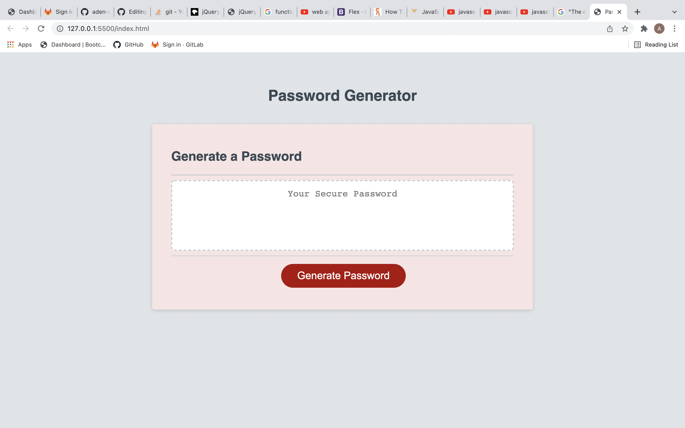
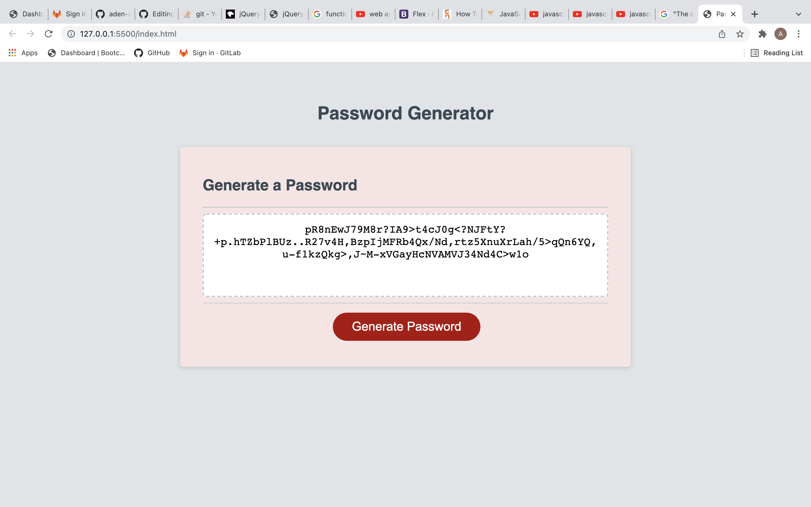

# Password-Generator-Javascript

Project's Title: Password-Generator-Javascript

Project Description: This project is the first javascript project i was assigned. I created a random password generator that takes in inputs in the form of prompts to specify what kind of password you want. This generator creates passwords that are 8-128 characters long. You can specify if you want uppercase, lowercase, or special characters in your password! I used HTML, CSS, and Javascript for this project.

Screenshots of website:

Links to website: https://aden-abdirahman.github.io/Password-Generator-Javascript/
